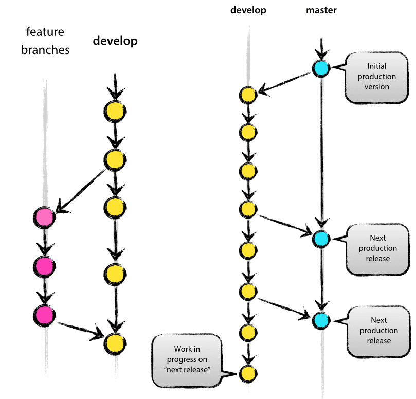

##Contributing Guidelines

¿Quiéres colaborar en el proyecto?  **¡¡¡ Genial !!! :)**

Pero antes, vamos a explicar como arrancar la aplicación en un entorno local para que no encuentres problemas.

####Desarrollo local
------

*SMS de desarrolla en un entorno muy característico*, ya que en síntesis son 4 microservicios distribuidos en dos "aplicaciones" de Google App Engine, que además necesitan de un servidor de desarrollo específico que simula el ecosistema de GAE, asignando puertos a las aplicaciones, nombres de dominio y simulando (entre otras cosas) la base de datos NDB.

######Requisitos iniciales

Una vez clonado el proyecto **el primer paso** sería  ejecutar el fichero ``requirement_bash.sh``, que descarga e instala todo lo necesario para trabajar.

Es un sencillo script de bash que realiza descargas e instalaciones de forma desatendida, en su mayoría haciendo uso de la herramienta **apt-get**, si no tienes un sistema basado en debian puedes instalar manualmente todos las dependencias del proyecto, ve al fichero y revisa lo que se necesita.

Entre otras cosas lo más importante que realiza el script es:

  1. Descargar el SDK de GAE
  2. Instalar MySQL
  3. Instalar algunas herramientas como curl, pip y librerías de conexión.
  4. Ejecutar los requirements de cada microservicio.

En cada microservicio del BackEnd (en FrontEnd no lo necesita) existe un fichero que instala todas las dependencias de python necesarias en cada caso (que además deben ser instaladas en la carpeta lib de cada uno).

Es fácil que por algún motivo se produzca algún error en la instalación desatendida, si es así revisa el paquete e intenta una instalación manual.

######Desarrollando

Una vez instalado todo lo necesario lo único que nesitarías sería ejecutar ``runAll.sh``, que primero arranca el FrontEnd y el BackEnd (usando respectivos scrips), arranca MySQL y aprovisiona el sistema con datos de muestra para que tengas usuarios de ejempo cargados.
Como verás, la apliación web se lanza en http://localhost:8080/ y el servidor GAE en http://localhost:8082/ donde podrás ver el estado de la NDB y las instancias (los tres microservicios del backend).

**et voilà !** ya puedes empezar a colaborar.

Si por algún motivo no quieres levantar toda la aplicación puedes levantar solo el BackEnd ejecutando ``runBackEnd-StandAlone.hs``
Para detener la aplicación deberás matar los procesos del servidor de desarrollo y para ello lo más sencillo es usar  ``kill -p <PID del proceso> `` aunque una manera más rádia es matando todo los procesos de python (si estás editanto con Atom te dará errores después) con ``kill -9 $(pidof python) ``.

####Issues, ramas y nuevas funcionalidades
------
Si no sabes por donde empezar puedes revisar el listado de [**issues**](https://github.com/ButterFlyDevs/StudentsManagementSystem/issues) del proyecto, creando nuevas o reparando y mejorando el código.

Como verás en el repositorio, el ciclo de desarrollo tiene dos fases, es decir, consta de dos ramas, **master** y **develop**.
La rama master será actualizada únicamente con las actualizaciones de código muy estables mientras que en develop iremos implementando las mejoras y nuevas características en testeo.

Por eso lo ideal es ir trabajando en la rama **develop** y pasar los cambios a master cuando se considere una nueva release estable del proyecto.
Además de esto, cuando se quiera añadir una nueva caracterísitca o móudulo mientras se reparan bugs o mejora el código en develop se crearía una raḿa con la característica, como muestra la figura (aunque no es estrictamente necesario).

Para conocer más sobre el modelo de ramas pulsa [aquí](http://nvie.com/posts/a-successful-git-branching-model/).
Si por otra parte quieres ayudar con la web el proyecto puedes trabajar en la rama **gp-pages** donde usamos jekyll para servir webs estáticas.

####Acuerdo de sintaxis

A la hora de implementar, preferimos usar una sintaxis similar a java para nombre compuestos, usando las primeras letras en mayúsculas en lugar de guiones bajos: preferimos funcionQueHaceAlgo() a funcion_que_hace_algo y los nombres largos de variables, funciones, clases, etc, a los cortos y crípticos.
Además intentamos documentar los máximo posible el código para que se fácilmente entendible por cualquier desarrollador, sin importar en principio la extensión de las explicaciones.

####Agradecimientos

Gracias por contribuir con SMS, cualquier aporte por pequeño que sea siempre es interesante.

> Juntos hacemos del Open Source comunidad.
