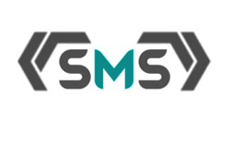
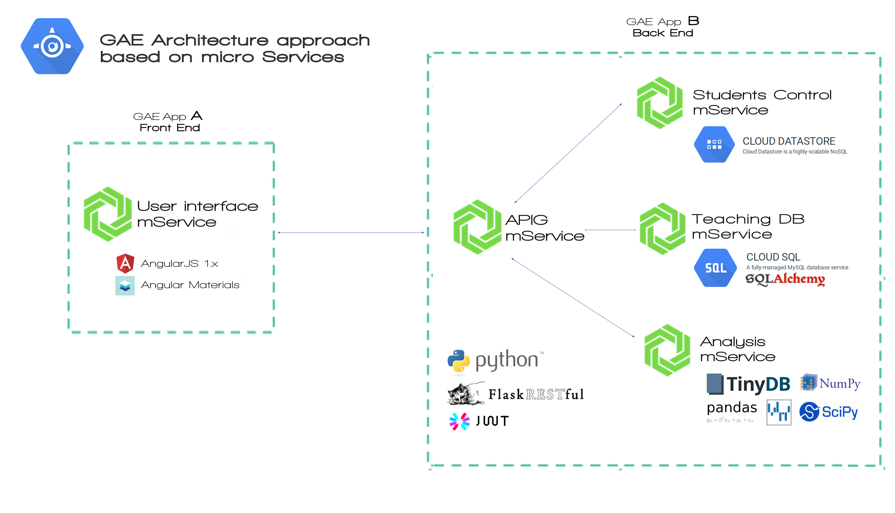

#### What is **SMS**?

Is a system to streamline processes in studies centers of any kind and size. Is designed to improve the boring and repetitive tasks of a standard studies center, through a complete web based app (that be able to run in any devide with a simple browser) give all this time saved to the teachers and admin staff to the mainly task in a studies center, teach.
While, the system will mine all these data to help you to analyce your students to help these to improve , achieve their  goals fastter and better, improve the marks of your center, have a better control with special things like bullying and discipline and in generall making more productive and efficient you center, saving a lot of money and  time working with paper.

#### How to use SMS in your study center?

In spite of this app could run in your own hardware (some server that be physically in your place of work) or in you own cloud in another IaaS like AWS, Azure, Heroku or similar, is specifically designed to run in Google App Engine, the popular PaaS of Google. The reason is simple: it offer us  all that we need to run our  microservices based architecture with the minimal costs, a perfect performance and be able to scal from zero to thousand of users quickly.

But anyway if you want deploy it in another place you will need make some changes in the code but nothing very difficult or imposible. Of course you always can contact with us for a particular deployment or a specification of our software and support to you needs if you don't have any team that can do it.

#### System Architecture

The design is based on microservices, splitting the logic work in few little services running in their own domain, all independent of the rest but with a close communication based on API REST.
Basic idea bhind it is to can have the perfect space to work to each section of app, with the best language, database and pattern that her domain require.

In spite of this, this approach give the way to adjust the hardware requirements better for any service in each situation, being able to scal each one independently when the system have more users, trying to adjust the cost of the hardarware to the minimun, **thinked and developed to be deployed in the cloud**.

#### Technology Stack

This are the mainly technologies that we are using:

- [Python](https://www.python.org/)
- [Flask](http://flask.pocoo.org/)
- [Javascript](https://www.javascript.com/)
- [AngularJS](https://angularjs.org/)
- [Angular Material](https://material.angularjs.org/latest/)
- [HTML5](https://www.w3.org/TR/html5/)
- [JSON](http://www.json.org/json-es.html)
- [MySQL](https://www.mysql.com/)
- [Google Cloud Platform](https://cloud.google.com/)

#### How to know more?

###### Technical Docs

You can generate the web based documentation of entire project using fabric tool to see the last verion with all new characteristics in development branch or visit the oficial last ready to production deploy version (master) **online** in Read The Docs, [here](https://readthedocs.org/).

###### Project Web Page

[butterflydevs.github.io/StudentsManagementSystem](http://butterflydevs.github.io/StudentsManagementSystem/)

###### Contact

If you want contact with us, please send an email to:

*butterflydevsmail@gmail.com*

#### How to contribute?

If you want contribute with the project you only need make a **fork** of the repo, see some open issue, see the state of some of subproject or create a new issue, start to code and make a pull requests.

But before please take a look at **CONTRIBUTING.md** to know how we works to follow the same way.

We will happy to see you working with us ;)
