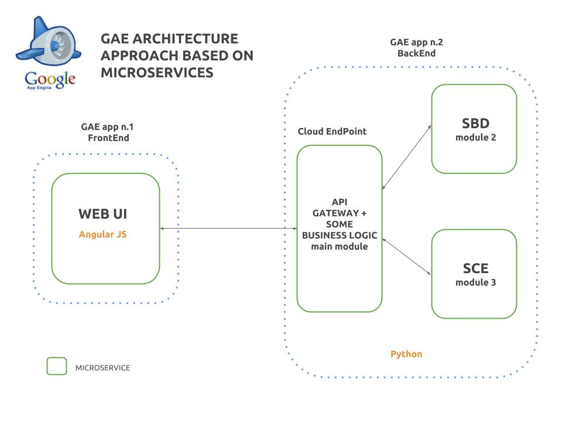

# Students Management System

SMS es un sistema de gestión basado en una **aplicación web** para centros docentes que agiliza y mejora la administración de estudiantes haciéndola más simple y eficiente.

###Arquitectura del sistema

El diseño de la aplicación está basado en microservicios, distribuyendo su funcionamiento en distintos nodos que de forma separada cumplen una función concreta e independiente del resto. Cada uno de estos servicios cuenta con sus propios recursos en la nube y pueden escalar de forma independiente tanto como lo necesiten, pueden ser desarrollados en lenguajes diferentes y tener acceso a servicios distintos o comunes dentro de la red de Google.

El siguiente esquema refleja el diseño general:

####Ejecución local

Para testear la aplicación es posible ejecutarla al completo en cualquier entorno local, para ello el único requisito previo será haber ejecutado el fichero de requisitos que descarga el SDK de GAE necesario para correr en modo desarrollador algunos de los servicios que la aplicación usa y ejecutar el lanzador **runAll.sh**.
