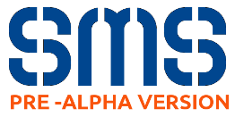

[**S**tudent **M**anagement **S**ystem](http://butterflydevs.github.io/StudentsManagementSystem/) en un agilizador de procesos para centros docentes diseñado para mejorar la recolección, gestión y análisis de datos académicos en tiempo real, potenciando y haciendo más fácil la toma de decisiones, análisis de estado y detección de problemas en centros educativos.

####Arquitectura del sistema

El diseño de la aplicación está basado en microservicios, distribuyendo su funcionamiento en distintos nodos que de forma separada cumplen una función concreta e independiente del resto pero contribuyendo a la lógica total de la aplicación.

 Cada uno de estos servicios cuenta con sus propios recursos en la nube y pueden escalar de forma independiente tanto como lo necesiten, pueden ser desarrollados en lenguajes diferentes y tener acceso a servicios distintos o comunes dentro de la red de Google.

El siguiente esquema refleja el diseño general:

Cuatro microservicios que comprenden en el [**FrontEnd**](https://github.com/ButterFlyDevs/StudentsManagementSystem/tree/master/SMS-Front-End), la interfaz gráfica del usuario, y el [**BackEnd**](https://github.com/ButterFlyDevs/StudentsManagementSystem/tree/master/SMS-Back-End), compuesto por tres, uno haciendo de capa de acceso (usamos el patrón APIGateway) , otro de base de datos principal del sistema de tipo relacional y el último haciendo la función de gestión de control de estudiantes. *Podemos conocer más acerca de cada uno accediendo a los respectivos directorios.*

Aunque SMS está pensado para correr en **Google App Engine** es fácilmente adaptable a una ejecución local en máquinas privadas con algunas modificiones relativamente simples.

*SMS es un proyecto Open Source que espera estar en producción muy pronto para un conjunto de centros con unas necesidades muy características que son en las que se está enfocando el desarrollo. A pesar de esto la idea es construirlo tan modularizable que sea fácilmente adaptable, extensible y rediseñable para cualquier necesidad específica. *

####¿Cómo usar SMS en un centro?

Para lanzar la aplicación es necesario crear una cuenta en GAE , habilitar algunos servicios y subir el código, en breve publicaremos guías que ayuden a conocer el procedimiento en detalle, mientras tanto y para cualquier duda, es fácil contactar con nosotros escribiendo a *butteflydevsmail@gmail.com* .

####¿Cómo contribuir al proyecto?

Si quieres colaborar con el proyecto tan solo tienes que hacer un **fork** del repositorio, realizar cualquier mejora o modificación del código y proponer un **pull-request**.
Pero antes de nada te aconsejamos que leas el fichero **CONTRIBUTING.md** donde especificamos mejor los detalles.

######Stack Tech

Estas son las principales tecnologías que usamos, por el momento, para el desarrollo:

- [Javascript](https://www.javascript.com/)
- [AngularJS](https://angularjs.org/)
- [HTML5](https://www.w3.org/TR/html5/)
- [UIkit](http://getuikit.com/)
- [Python](https://www.python.org/)
- [Flask](http://flask.pocoo.org/)
- [gRPC](http://www.grpc.io/)
- [JSON](http://www.json.org/json-es.html)
- [MySQL](https://www.mysql.com/)
- [Google Cloud Platform](https://cloud.google.com/)

**¿Te animas a participar en el proyecto?**

A cambio, cantidades ingentes de *amor, cerverza y pizza* ;)
