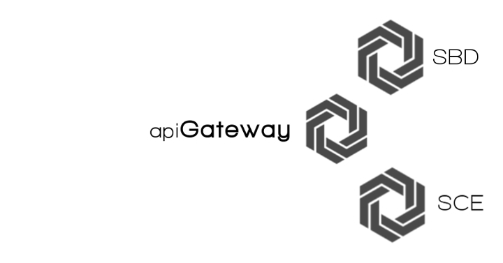

##SMS Back-End

Conforma el conjunto de microservicios que forman el back end de la aplicación, que sigue el patrón [API Gateway](http://microservices.io/patterns/apigateway.html) y que están diseñados (de ahí la unión en esta carpeta) para desplegarse como una sola aplicación en *Google App Engine*  (allí módulos).

> Para lanzar todo el subsistema podemos ejecutar el script <code>run.sh</code>, que pone en ejecución cada servicio bajo el mismo sevidor de desarrollo asignando puertos de conexión específicos.
