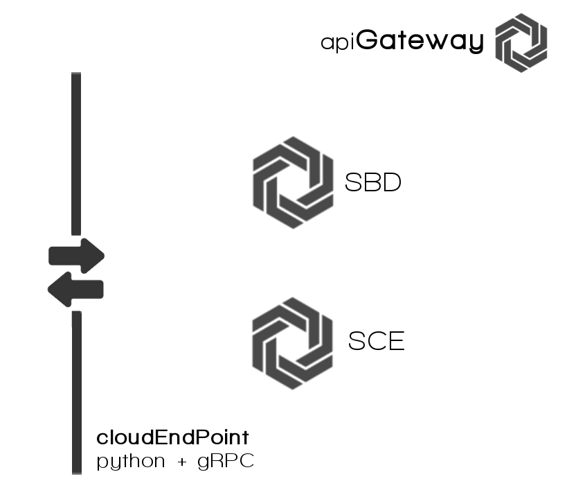

##API Gateway

**microservicio API Gateway**, supone la puerta de entrada al back end del sistema. Hace de pasarela de comunicación general con el resto de microservicios de los que se compone la aplicación al completo. Implementada como un [Cloud EndPoint](https://cloud.google.com/appengine/docs/python/endpoints/create_api) escrito en Python ofrece todos los métodos útiles de la apliación (añadiendo en los casos necesarios algo de lógica).
Esta configuración responde al patrón [API Gateway](http://microservices.io/patterns/apigateway.html) de diseño de aplicaciones basadas en microservicios.

