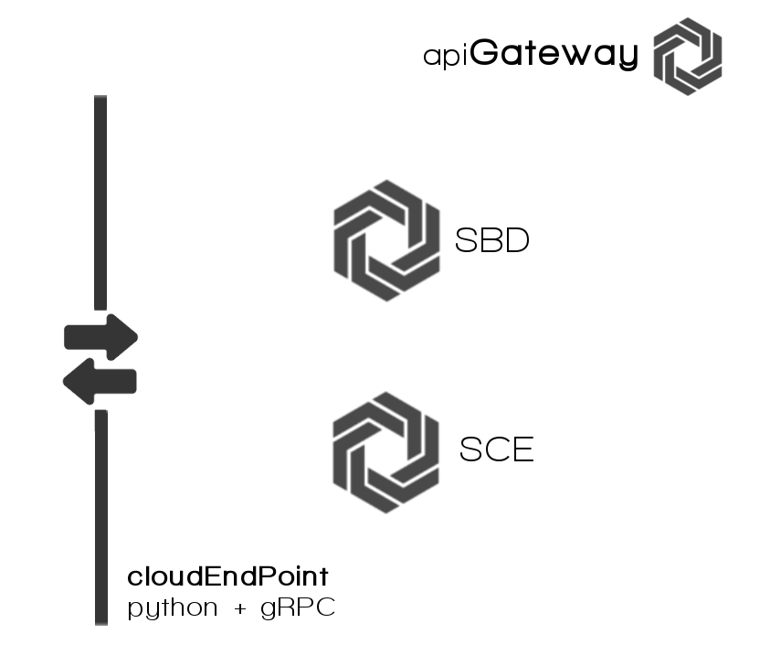

##APIGmS

**API Gateway micro Service**, it's the main door to system back-end. Do all communications with the rest
of microservicios, to doing see at UI only one.

This configuration is based in [API Gateway](http://microservices.io/patterns/apigateway.html) software design pattern.

