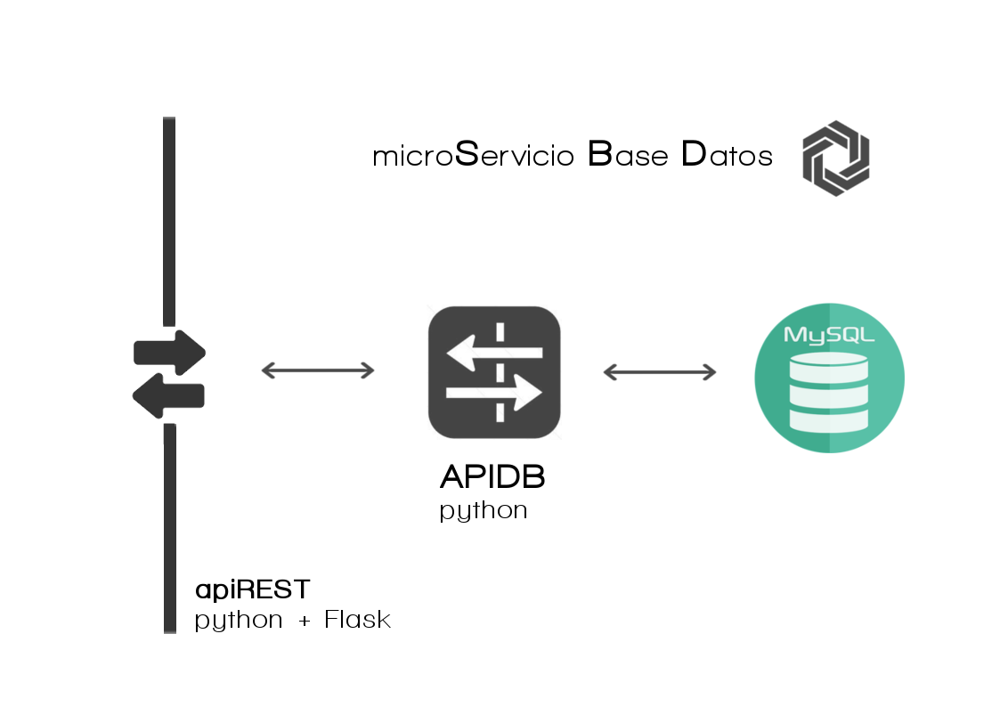

##SBD

**micro Servicio Base de Datos** ofrece la base de datos relacional general de la aplicación.
El acceso a este servicio se realiza mediante una interfaz REST.

Para poder ejecutar este servicio en un entorno local necesitaremos una instancia de **mySQL** instalada. En [Google Cloud Platform](https://cloud.google.com/) este servicio corre conectado al servicio [CloudSQL](https://cloud.google.com/sql/) que ofrece una base de datos SQL a la que para conectarnos usamos la librería de python [MySQLdb](http://mysql-python.sourceforge.net/MySQLdb-1.2.2) y que simulamos en local con una instancia normal de mySQL.
La instalación del gestor MySQL se realiza dentro del proceso de instalación de requisitos inicial cuando ejecutamos **requirements_bash.sh** (situado en la raíz del proyecto).

Una vez instaladas todas los requisitos, el fichero <code>aprovisionador/aprovisionadorDatosEjemplo.sh</code> provee al sistema de datos de ejemplo, incluido el SBD haciendo uso antes del fichero <code>DBCreatorv1.sql</code> que crea la estructura de la base de datos **sms** antes de usar el microservicio APIGateway y sus métodos para introducir conteido al sistema. Este servicio hace uso a su vez de SBD que es quien realmente introduce los datos en la instancia de MySQL.

> Si el sistema falla puede que el demonio de mysql este parado, para activarlo solo hay que ejecutar <code>sudo /etc/init.d/mysql start </code>
