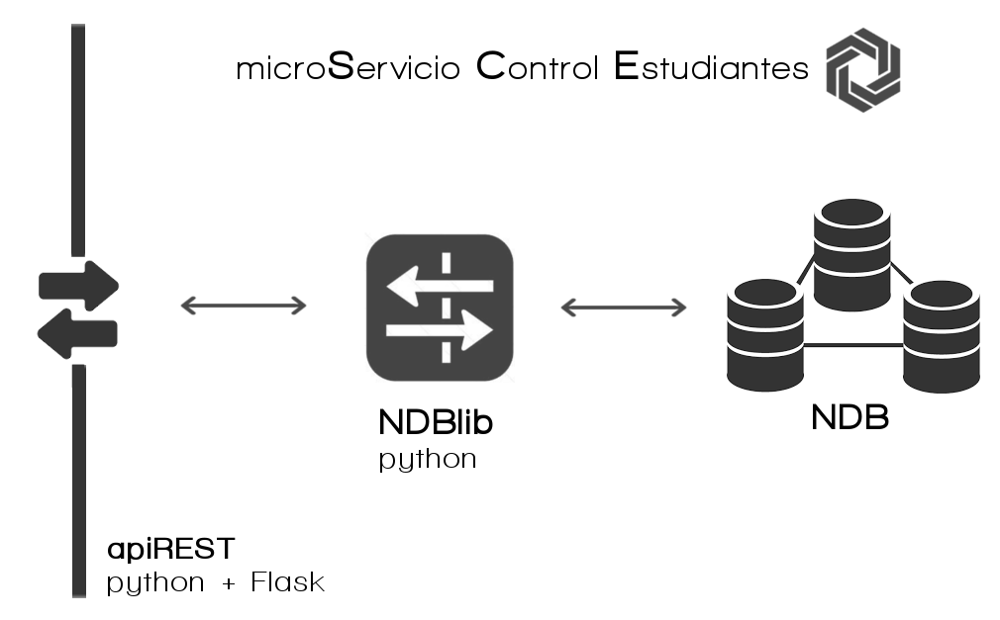

##SCE

**micro Servicio Control de Estudiantes**, es el encargado de almacenar y realizar la gestión de los datos de los informes de asistencia y partes disciplinarios que los profesores realizan.

La información es almacenada en una *Highly Scalable NoSQL Database*, en concreto la [Cloud Datastore](https://cloud.google.com/datastore/docs/) de [Google Cloud Platform](https://cloud.google.com/products/), usando la librería [Google Datastore NDB Client Library](https://cloud.google.com/appengine/docs/python/ndb/) que permite a aplicaciones GAE conctarse a la Cloud Datastore.

Cloud Datastore tiene una gran cantidad de [APIs y librerías](https://cloud.google.com/datastore/docs/apis) para clientes dependiendo del lenguaje que estemos usando y si nuestra aplicación está o no en GAE. En nuestro caso si lo está y usamos [Python NDB Client Library](https://cloud.google.com/appengine/docs/python/ndb/) que también está disponible para Go y Java.
El acceso a este microservicio se realiza través de una Api Rest escrita en Python y Flask

###### Documentación
La documentación en formato html de este microservicio se general ejecutando `make html` dentro del directorio docs.
