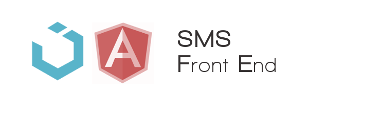

Implementación de la interfaz gŕafica del usuario, usando el framework de javascript [AngularJS](https://angularjs.org/) y el kit de css [UIKit](http://getuikit.com/). Hace uso del microservicio APIGateway del Back-End para todas sus operaciones. Implementada como otra aplicación más para Google App Engine distinta (a todos los efectos) se entiende como  otro *microservicio* del proyecto.

